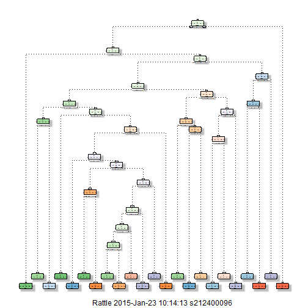

# Practical Machine Learning Course Project.

## Prediction of Weight Lifting Exercise Behavioural Patterns

#### - Kayode Ayankoya (January, 2015)

Studies of behavioral patterns during physical exercise is a very important field that have immense health benefits and applications sports training and profession. The use of devices that collect data during exercises make it possible to identify, measure and scientifically predict behaviorial patterns. This project uses the data collected by Velloso et. al. (2013) on weight lifting exercises of 6 participants to predict the behaviorial patterns (the manner in which exercises) during exercises.


```r
library(caret)
```

```
## Loading required package: lattice
## Loading required package: ggplot2
```

```r
library(randomForest)
```

```
## randomForest 4.6-10
## Type rfNews() to see new features/changes/bug fixes.
```

```r
library(rattle)
```

```
## Rattle: A free graphical interface for data mining with R.
## Version 3.4.1 Copyright (c) 2006-2014 Togaware Pty Ltd.
## Type 'rattle()' to shake, rattle, and roll your data.
```

```r
library(rpart.plot)
```

```
## Loading required package: rpart
```

```r
library(ggplot2)
```


### Data processing

The data which is splitted into the training and testing sets is available at:

-  Training sets - https://d396qusza40orc.cloudfront.net/predmachlearn/pml-training.csv

-  Test sets - https://d396qusza40orc.cloudfront.net/predmachlearn/pml-testing.csv

They are loaded into the R work enviroment as shown below.


```r
trainingUrl <- "http://d396qusza40orc.cloudfront.net/predmachlearn/pml-training.csv"
testUrl <- "http://d396qusza40orc.cloudfront.net/predmachlearn/pml-testing.csv"

#load and clean the training dataset
trainingset <- read.csv("pml-training.csv", na.strings=c("NA","#DIV/0!", ""))

#load and clean the test dataset
testset <- read.csv('pml-testing.csv', na.strings=c("NA","#DIV/0!", ""))

#The first seven columns of both datasets are metadata and not relevant to this study. Hence they are
#excluded.

trainingset   <-trainingset[,-c(1:7)]
testset   <-testset[,-c(1:7)]

# Furthermore, a preview of both datasets shows that a lot of the columns contain missing values only that are meant for descriptive statistics for each variable. These colums are removed with these codes.

trainingset <- trainingset[, -grep("^var_", colnames(trainingset))]
trainingset <- trainingset[, -grep("^skewness_", colnames(trainingset))]
trainingset <- trainingset[, -grep("^kurtosis_", colnames(trainingset))]
trainingset <- trainingset[, -grep("^max_", colnames(trainingset))]
trainingset <- trainingset[, -grep("^min_", colnames(trainingset))]
trainingset <- trainingset[, -grep("^avg_", colnames(trainingset))]
trainingset <- trainingset[, -grep("^amplitude_", colnames(trainingset))]
trainingset <- trainingset[, -grep("^stddev_", colnames(trainingset))]
```


### Study design and Cross validation

For the purpose of cross validation this study will only use the test dataset for validation at the end of the analysis. But will create a sub-testing set from training set for cross validation and feature selection. This is achived below, in order to ensure reproducibility of this project a seed will be set at the before splitting the data.


```r
set.seed(1234)
inTrain <- createDataPartition(y=trainingset$classe, p=0.6, list=FALSE)

training <- trainingset[inTrain,]
testing <- trainingset[-inTrain,]
```


### Modelling and Predictions
The first classification tree and Random Forest approach will be used to train 2 different models that will be compared later in this project.

#### Classification model

```r
## Create model
modFit <- rpart(classe ~ ., data=training, method="class")

## Display the Decision Tree
fancyRpartPlot(modFit)
```

 

```r
## Predict new values using the sub Testing set created from the original training set 
pred <- predict(modFit, newdata=testing, type="class")

## Calculates a cross-tabulation of observed and predicted classes with associated statistics
confusionMatrix(pred, testing$classe)
```

```
## Confusion Matrix and Statistics
## 
##           Reference
## Prediction    A    B    C    D    E
##          A 1980  212   21   72   31
##          B   85  862   72   90   98
##          C   56  153 1086  209  175
##          D   71  101  110  823   89
##          E   40  190   79   92 1049
## 
## Overall Statistics
##                                           
##                Accuracy : 0.7392          
##                  95% CI : (0.7294, 0.7489)
##     No Information Rate : 0.2845          
##     P-Value [Acc > NIR] : < 2.2e-16       
##                                           
##                   Kappa : 0.6699          
##  Mcnemar's Test P-Value : < 2.2e-16       
## 
## Statistics by Class:
## 
##                      Class: A Class: B Class: C Class: D Class: E
## Sensitivity            0.8871   0.5679   0.7939   0.6400   0.7275
## Specificity            0.9401   0.9455   0.9085   0.9434   0.9374
## Pos Pred Value         0.8549   0.7142   0.6468   0.6893   0.7234
## Neg Pred Value         0.9544   0.9012   0.9543   0.9304   0.9386
## Prevalence             0.2845   0.1935   0.1744   0.1639   0.1838
## Detection Rate         0.2524   0.1099   0.1384   0.1049   0.1337
## Detection Prevalence   0.2952   0.1538   0.2140   0.1522   0.1848
## Balanced Accuracy      0.9136   0.7567   0.8512   0.7917   0.8324
```

#### Rain Forest model


```r
##modFit <- train(training$classe ~ ., data=training, method="rf", type="class")
modFit1 <- randomForest(training$classe ~ . , data=training, type="class")
##modFit

## Display the Decision Tree
##fancyRpartPlot(modFit$finalModel)
##fancyRpartPlot(modFit1)

## Predict new values using the sub Testing set created from the original training set 
pred1 <- predict(modFit1, testing, type="class")

## Calculates a cross-tabulation of observed and predicted classes with associated statistics
confusionMatrix(pred1, testing$classe)
```

```
## Confusion Matrix and Statistics
## 
##           Reference
## Prediction    A    B    C    D    E
##          A 2231   12    0    0    0
##          B    0 1501    9    0    0
##          C    0    5 1354   22    2
##          D    1    0    5 1262    2
##          E    0    0    0    2 1438
## 
## Overall Statistics
##                                           
##                Accuracy : 0.9924          
##                  95% CI : (0.9902, 0.9942)
##     No Information Rate : 0.2845          
##     P-Value [Acc > NIR] : < 2.2e-16       
##                                           
##                   Kappa : 0.9903          
##  Mcnemar's Test P-Value : NA              
## 
## Statistics by Class:
## 
##                      Class: A Class: B Class: C Class: D Class: E
## Sensitivity            0.9996   0.9888   0.9898   0.9813   0.9972
## Specificity            0.9979   0.9986   0.9955   0.9988   0.9997
## Pos Pred Value         0.9947   0.9940   0.9790   0.9937   0.9986
## Neg Pred Value         0.9998   0.9973   0.9978   0.9964   0.9994
## Prevalence             0.2845   0.1935   0.1744   0.1639   0.1838
## Detection Rate         0.2843   0.1913   0.1726   0.1608   0.1833
## Detection Prevalence   0.2859   0.1925   0.1763   0.1619   0.1835
## Balanced Accuracy      0.9987   0.9937   0.9926   0.9901   0.9985
```

The result from the two models show that the Rain Forest predictions are more accurate than the decision tree predictions. The Rain Forest model provides an Accuracy of 99.24% with a confidence interval between 99.02% as lower limit and 99.42% as upper limit.  This suggest that the out-of-sample error can be fairly estimated at a maximum of 5% with 40% of the training data used for cross validation.

Hence the RainForest model will be applied to the testing dataset provided by on the course page. With an expected 5% out of sample error, it is expected that the test set with 20 predictions will produce a maximum of 1 error, based on the cross validation that has been performed.

## Apply RainForest model on Testing dataset


```r
pred2 <- predict(modFit1, testset, type="class")

print(pred2)
```

```
##  1  2  3  4  5  6  7  8  9 10 11 12 13 14 15 16 17 18 19 20 
##  B  A  B  A  A  E  D  B  A  A  B  C  B  A  E  E  A  B  B  B 
## Levels: A B C D E
```

These predictions produced a 100% accuracy when checked with the prediction assignment submission page.


